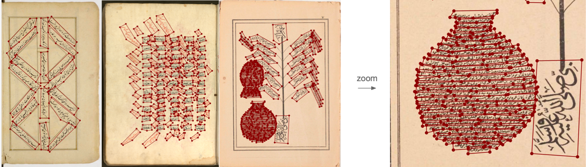

### MONSTERMASH

##### Multidirectional, Overlapping, Nested, Spiral Text Extraction for Recognition Models of Arabic-Script Handwriting




----

### Dataset

The dataset is under `data/`. We use labelme to annotate the dataset. 


### Three baseline models

#### kraken

Install `https://github.com/mittagessen/kraken`, and we use 4.3 in our project.

checkout `models/kraken_pipe.ipynb` for inference.

#### TESTR

Install instruction can be found: https://github.com/mlpc-ucsd/TESTR

#### doc-ufcn

Install instruction can be found: `https://gitlab.teklia.com/dla/doc-ufcn` (you may need to register first to visit their gitlab).

Checkpoints is available on huggingface: https://huggingface.co/Teklia/doc-ufcn-generic-historical-line


### Citaion

```
@inproceedings{chen2024monstermash,
  title={{MONSTERMASH}: Multidirectional, Overlapping, Nested, Spiral Text Extraction for Recognition Models of Arabic-Script Handwriting},
  author={Chen, Danlu and Murel, Jacob and Taimoor Shahid and Xiang Zhang and Jonathan Parkes Allen and Taylor Berg-Kirkpatrick and and David A.Smith},
  booktitle={International Conference on Document Analysis and Recognition, IWCP workshop},
  year={2024},
  organization={Springer}
}
```