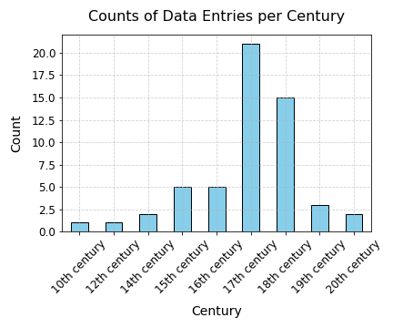
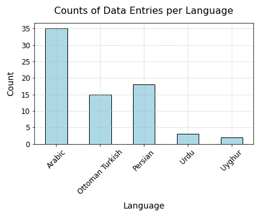

### MONSTERMASH

##### Multidirectional, Overlapping, Nested, Spiral Text Extraction for Recognition Models of Arabic-Script Handwriting


The data is collected from 10th centuries to 20th. Writing sytle included but not limited to Naskh (varied style), Nasta'liq, Maghribi, Sudani, Ta'liq and Bihari. 







For example, the follow image:


```
{
  "pid": 26,
 "title": "Hartford Seminary Arabic MSS 199/Jawāhiral-nuṣūṣ fī ḥall kalimāt al-Fuṣūṣ",	
"time": "18th century",
"language": "Arabic",
"style: "Naskh",
"note": "Complex title page with multiple ownersip notes etc and other annotations",
"polygons": [(x0, y0), (x1, y1), ..., ]

}

```
#### Usage 

The dataset is under `data/`. We use labelme to annotate the dataset. 

----

### Three baseline models

##### kraken

1. Install `https://github.com/mittagessen/kraken`, and we use 4.3 in our project.

2. Download the model:

```
wget https://github.com/OpenITI/arabic_script_ocr_models/blob/main/ms_mellon_print_layout.mlmodel
```

3. Run script at `models/kraken_pipe.ipynb` for inference code.

##### TESTR

Install instruction can be found: https://github.com/mlpc-ucsd/TESTR

##### doc-ufcn

Install instruction can be found: `https://gitlab.teklia.com/dla/doc-ufcn` (you may need to register first to visit their gitlab).

Checkpoints is available on huggingface: https://huggingface.co/Teklia/doc-ufcn-generic-historical-line


### Citaion

```
@inproceedings{chen2024monstermash,
  title={{MONSTERMASH}: Multidirectional, Overlapping, Nested, Spiral Text Extraction for Recognition Models of Arabic-Script Handwriting},
  author={Chen, Danlu and Murel, Jacob and Taimoor Shahid and Xiang Zhang and Jonathan Parkes Allen and Taylor Berg-Kirkpatrick and and David A.Smith},
  booktitle={International Conference on Document Analysis and Recognition, IWCP workshop},
  year={2024},
  organization={Springer}
}
```
